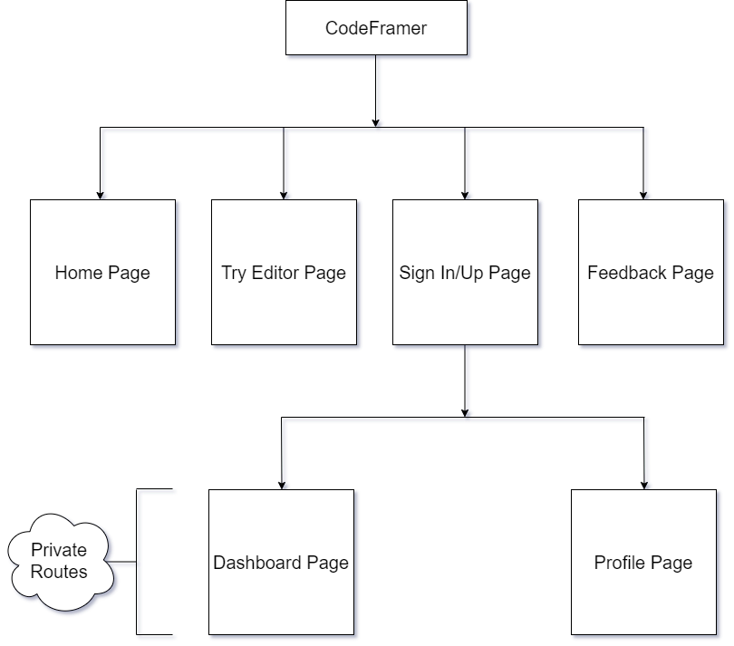

<h1>CodeFramer</h1>

CodeFramer is a free and open-source online code editor that allows you to write and edit HTML, CSS, and JavaScript code. It is a Single-Page Application (SPA) built with modern web technologies like Next.js 14 for the front-end and Firebase for the back-end, offering seamless performance and robust functionality.

<h1>Features</h1>

Syntax highlighting for HTML, CSS, and JavaScript
Autocompletion for HTML tags and CSS properties
Seamless Access & Save: Sign in to store your code snippets and projects securely in the cloud. Access them from any device, anywhere, for uninterrupted coding sessions.
Live code preview
Error checking and linting
Code collaboration features (coming soon)

<h1>Getting Started</h1>

Clone the repository:
git clone https://github.com/your-username/codeframer.git
Install the dependencies:
npm install
Start the development server:
npm start
Open http://localhost:3000 in your web browser.
Deployment

CodeFramer can be deployed to any static hosting platform, such as Netlify or Heroku. Once you have deployed your code, you can share the URL with others to collaborate on your projects.

<h1>License</h1>

CodeFramer is licensed under the MIT License.
