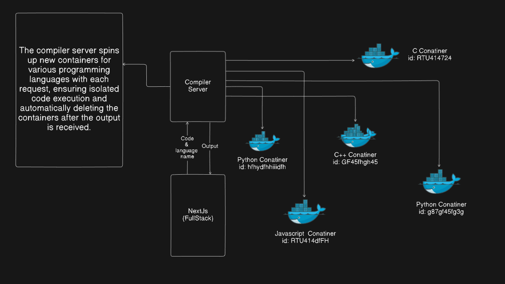

# CodeFramer

CodeFramer is a versatile code editor designed to enhance your coding experience with its intuitive interface and powerful features. Built with a focus on performance and resource efficiency, CodeFramer is perfect for developers looking for a reliable coding platform.

<video src="https://github.com/user-attachments/assets/918cfc40-e247-4faf-afd2-e854fb5bb10e" width="900px" alt="Intro Video" controls></video>

## Features

- **Isolated Execution Environment:** Each code execution request creates a new isolated container. This ensures that code runs securely and independently, providing an output while maintaining system integrity. Containers are deleted automatically after execution to optimize resource usage.
- **Resource Efficient:** CodeFramer operates efficiently, minimizing system resource consumption to ensure smooth performance.
- **Autocomplete:** Speed up your coding process with intelligent autocomplete suggestions that help you write code faster.
- **Syntax Highlighting:** Benefit from accurate syntax highlighting across a variety of programming languages, improving code readability.
- **AI Chatbot Support:** Get intelligent assistance and real-time support for your coding queries through our integrated AI chatbot.
- **Modern Interface:** Enjoy a clean and intuitive user interface that promotes productivity.
- **Enhanced Performance:** Experience fast coding and editing with optimized performance, allowing for seamless multitasking.

## Architecture



The architecture of CodeFramer is designed to ensure high performance, security, and scalability. The system is divided into several key components:

1. **Frontend:** Built with Next.js, the frontend provides a modern and responsive user interface. It communicates with the backend through API routes.
2. **Backend:** The backend, also developed with Next.js 14 API Routes, Node.js, and Express, handles all the business logic and API requests.
3. **Database:** PostgreSQL is used for data storage, offering flexibility and scalability.
4. **Containerized Execution:** Docker is used to create isolated containers for code execution, ensuring security and resource efficiency.
5. **Authentication:** Auth.js is used for handling authentication, providing secure and efficient user login and registration processes.
6. **Styling:** Tailwind CSS, ShadCN, and Aceternity UI are used for styling, providing a clean and consistent look.
7. **Additional Libraries:** React Query for data fetching and state management, and Monaco Editor for an enhanced coding experience.

This modular architecture allows CodeFramer to deliver a seamless and efficient coding environment.

## Installation

### Prerequisites

Ensure you have the following installed on your machine:

- [Docker](https://www.docker.com/get-started)
- [Node.js](https://nodejs.org/en/download/)

### Steps

1. **Clone the repository:**

    ```bash
    git clone https://github.com/lakshaybabbar/codeframer.git
    ```

2. **Navigate to the project directory:**

    ```bash
    cd codeframer
    ```

3. **Install dependencies for both Next.js application and compiler server:**

    ```bash
    # For Next.js application
    cd next-app
    npm install

    # For Compiler Server
    cd ../compiler-server
    npm install
    ```

4. **Configure Environment Variables:**

    Create a `.env.local` file in the Next.js application and add the following variables:

    - `DATABASE_URL`: Postgresql URI address.
    - `BASE_URL`: Hosting address.
    - `CODE_AI_API`: Google AI Studio API key for editor in-built AI.
    - `GENERAL_AI_API`: Google AI Studio API key for chat.
    - `COMPILER_API`: Path to the compiler server.
    - `COMPILER_SECRET`: Access key for compiler server.
    - `AUTH_SECRET`: Secret for generating JWT tokens.
    - `AUTH_GOOGLE_ID`: Your Google OAuth client ID.
    - `AUTH_GOOGLE_SECRET`: Your Google OAuth client secret.
    - `AUTH_GITHUB_ID`: Your GitHub OAuth client ID.
    - `AUTH_GITHUB_SECRET`: Your GitHub OAuth client secret.

    Create a `.env` file in the compiler server and add the following variables:

    - `ACCESS_SECRET_KEY`: Your defined access secret key. Note: Same as Next.js application.
    - `ORIGIN`: Allowed origin for CORS.

5. **Start the Compiler Server for code execution in an isolated environment:**

    ```bash
    cd compiler-server
    bash ./entrypoint.sh
    ```

6. **Start the application development server:**

    ```bash
    cd ../next-app
    npm run dev
    ```

## Bug Reports

If you encounter any bugs or issues while using CodeFramer, please open an issue on GitHub with detailed information about the problem.

## Contributions

At this time, we are not accepting contributions to CodeFramer. We appreciate your interest and understanding.

## License

CodeFramer is licensed under the Creative Commons Attribution-NonCommercial 4.0 International License. This means you can use, share, and adapt the project for personal use only, but not for commercial purposes.